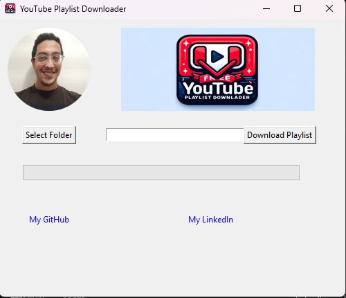

# Utube

### A small program that allows you to download YouTube Playlists whether they are music, films, or educational videos.

### Link to program : https://drive.google.com/drive/folders/1FxFniLw8vJcDVdKaC7uMglAwIKgnO5Ip?usp=drive_link

### 1. Run the program by Double clicking the Utube_gui.exe

### 2. Or runing it on your cmd or code editor :

### 3. Create a virtual environement :

#### python -m venv Utube_requirements

### 4. Activate the environement :

### 4.1 Windows systems:

#### Utube_resquirements\Scripts\Activate

### 4.2 Linux/Mac:

#### source Utube_requirements/bin/activate

### 5. Install the required libs to run the script :

#### pip install -r requirements.txt

### 6. Voila! just Run the script :

#### python Utube_gui.py
